## Projekt – Szkielety Programistyczne

Przedstawiony projekt to aplikacja internetowa będąca fanpage’m poświęconym zespołowi Nirvana. Projekt został stworzony w programie <i>Visual Studio Code</i>. Utworzony został serwer w express oraz klient w technologii react. Cała aplikacja działa z wykorzystaniem MERN, gdyż współpracuje z nierelacyjną bazą danych MongoDB i realizuje operacje CRUD.

---

### 1. Wstęp

Implementacja autoryzacji użytkowników opiera się na generowaniu tokena JWT na backend, co zostało zrealizowane przy użyciu biblioteki <i>jsonwebtoken</i>. Hasła w bazie danych są haszowane z wykorzystaniem biblioteki <i>bcrypt</i>, a funkcje serwisu dostępne dla zalogowanych użytkowników są zabezpieczone przed nieuprawnionym dostępem (próba wejścia na daną stronę, nie będąc zalogowanym, kończy się przekierowaniem na stronę z logowaniem). Wizualny aspekt strony internetowej został ukształtowany przy użyciu gotowych stylów i skryptów Bootstrap, a oprócz tego wykorzystane zostały własne napisane style CSS.

Kod projektu został zorganizowany w dwóch folderach (klient i serwer). Na serwerze zostały utworzone modele i trasy dla odpowiednich endpointów, a także middleware odpowiedzialny za autoryzacje tokenem. W każdym modelu na serwerze wprowadzona jest walidacja z użyciem biblioteki <i>joi</i> (bądź biblioteki <i>multer</i> w przypadku wgrywania plików graficznych). Po stronie klienta wszystkie formularze są również odpowiednio walidowane. Struktura klienta opiera się na wykorzystywanych komponentach.

Aplikacja współpracuje z nierelacyjną bazą danych MongoDB i realizuje operacje CRUD na odpowiednich kolekcjach. Każdemu modelowi utworzonemu na serwerze odpowiada jedna kolekcja w bazie danych. W przypadku komentarzy występuje powiązanie z użytkownikiem poprzez jego id, w kolekcji produktów jest powiązanie z kolekcją kategorii, a kolekcja przechowująca dokumenty związane z koszykiem, ma również powiązanie z id użytkownika.

---

### 2. Logowanie i Rejestracja

Po uruchomieniu aplikacji widoczne jest okienko logowania z możliwością przejścia do rejestracji użytkownika. Oba formularze są odpowiednio walidowane zarówno po stronie klienta, jak i na serwerze (tak samo wszystkie formularze w aplikacji). Nie można utworzyć użytkownika na ten sam email, który występuje już w bazie danych. Wprowadzone hasła są odpowiednio haszowane.

  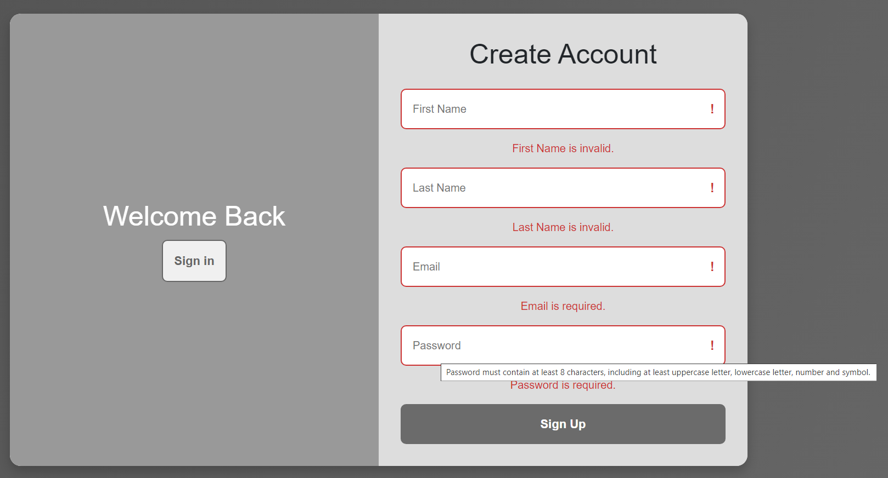

  <i>Rys. 1. Walidacja formularza rejestracji</i>

 

  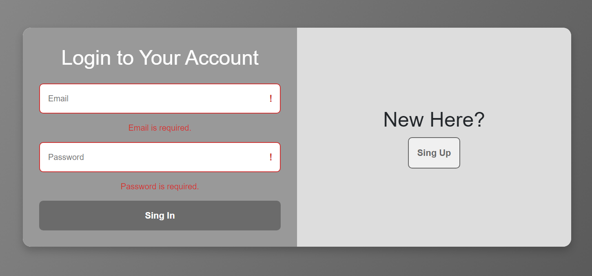

  <i>Rys. 2. Walidacja formularza logowania</i>

---

### 3. Strona główna i użytkownicy

Po prawidłowym zalogowaniu do aplikacji użytkownik widzi stronę główną, do której można także przejść poprzez naciśnięcie nazwy aplikacji. Z prawej strony paska górnego znajduje się menu typu <i>hamburger</i>. Po rozwinięciu menu użytkownik może zobaczyć szczegóły dotyczące swojego konta, listę wszystkich użytkowników aplikacji, a także wylogować się bądź usunąć konto. W tabeli użytkowników zastosowano paginację, aby jednocześnie na stronie wyświetlało się maksymalnie 6 elementów listy.

  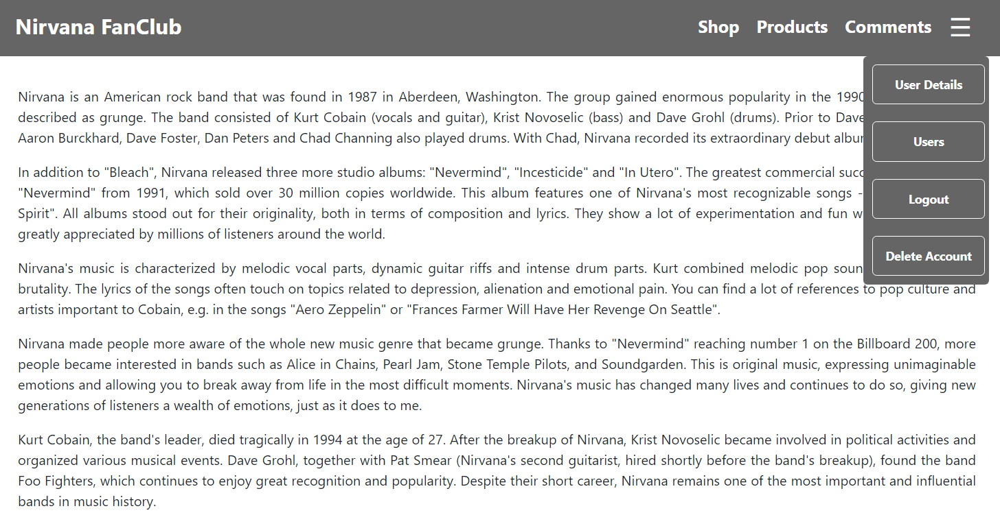

  <i>Rys. 3. Widok strony głównej wraz z rozwiniętym menu</i>

 

  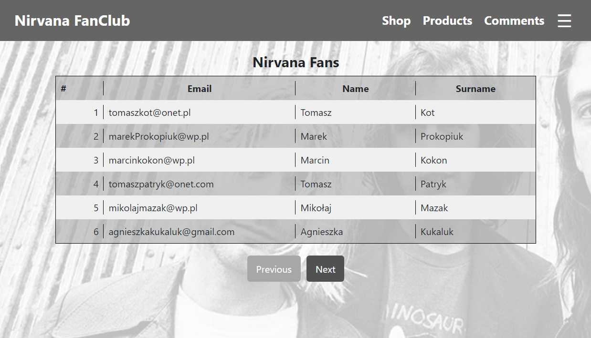

  <i>Rys. 4. Widok listy zarejestrowanych użytkowników</i>

 

  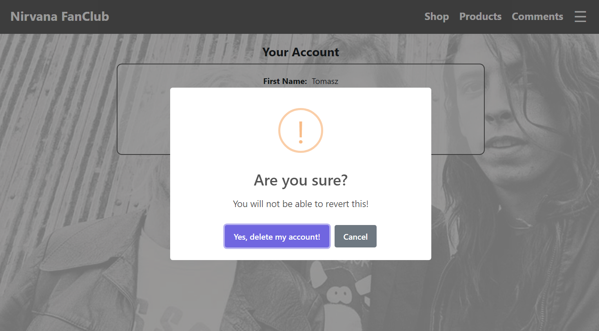

  <i>Rys. 5. Okienko widoczne po wybraniu przycisku usunięcia konta</i>

---

### 4. Komentarze

Jednym z najważniejszych elementów strony są komentarze, do których można przejść poprzez zakładkę <i>Comments</i>. Użytkownik ma możliwość przeglądania opinii wystawionych przez wszystkich użytkowników, dodania własnej opinii, a także edytowania i usuwania jedynie tych wystawionych przez siebie. Zastosowana została również paginacja, podobnie jak w przypadku tabeli z użytkownikami. Opinie są przechowywane w bazie danych i są na nich realizowane funkcjonalności CRUD.

Wciśnięcie odpowiedniego przycisku przenosi użytkownika do formularza dodawania opinii. Można tam wybrać ulubiony album z listy rozwijanej, wpisać ulubiony utwór, a także uzupełnić widoczne pole tekstowe własnym komentarzem. Podobna sytuacja jest w przypadku edycji swojej własnej opinii. Formularz jest odpowiednio walidowany zarówno po stronie klienta, jak i po stronie serwera.

  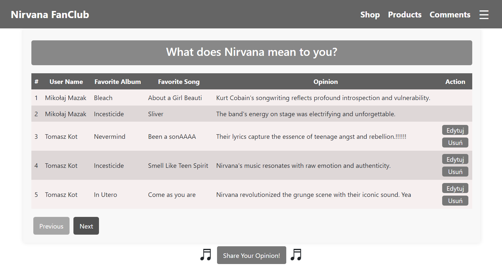

  <i>Rys. 6. Widok listy wystawionych opinii przez użytkowników</i>

 

  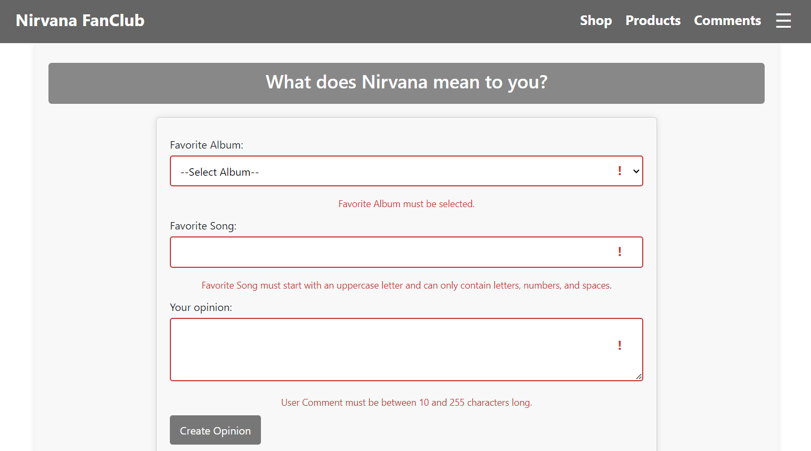

  <i>Rys. 7. Widok formularza dodawania opinii</i>

---

### 5. Produkty

Następnym elementem aplikacji jest zakładka <i>Products</i>, która służy do łatwego podejrzenia, wprowadzania, edytowania i usuwania produktów ze sklepu internetowego. Dodając lub edytując produkt, należy podać jego nazwę, opis, dostępną ilość (wartość całkowita równa minimum 1), cenę za sztukę (wartość o dwóch miejscach po przecinku równa minimum 0,01) oraz jedną z kategorii produktu, które są pobierane z bazy danych. Trzeba także dodać plik graficzny do każdego produktu. Formularze są odpowiednio walidowane np. nie da się wrzucić w miejsce zdjęcia innego pliku niż z rozszerzeniem <i>.jpg</i>, <i>.jpeg</i> lub <i>.png</i>. W celu zaprezentowania projektu zakładka <i>Products</i> jest dostępna obecnie dla wszystkich użytkowników, jednakże ostatecznie jedynie administrator będzie mógł dodawać i edytować produkty w bazie danych.

  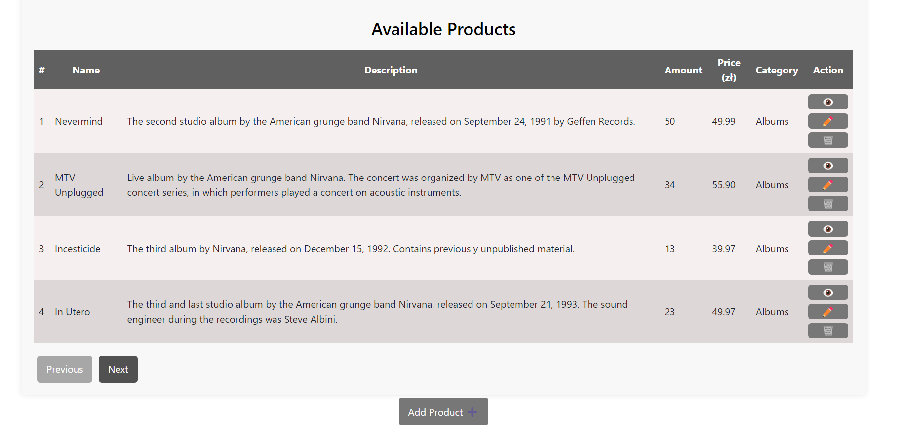

  <i>Rys. 8. Widok listy dostępnych produktów na stronie</i>

 

  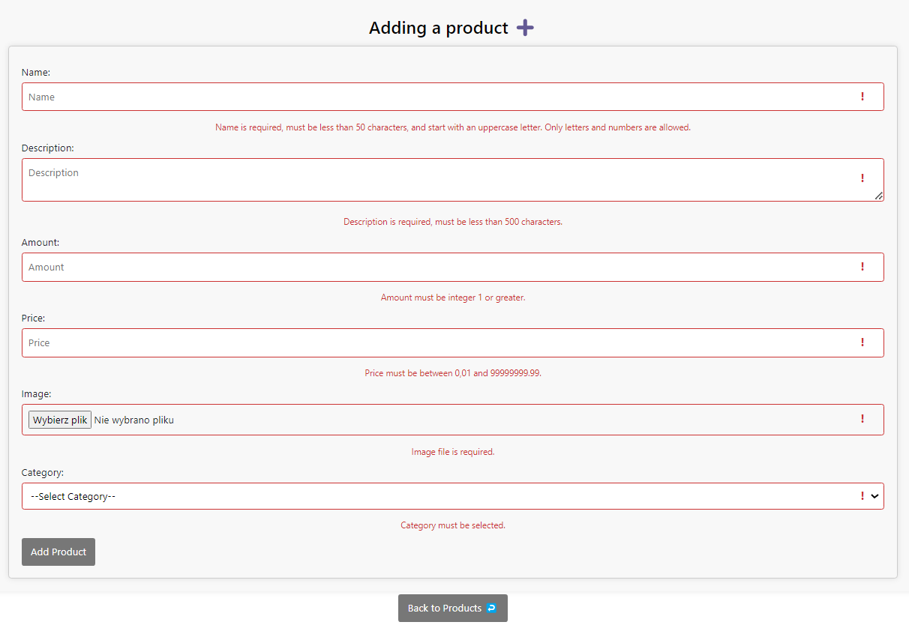

  <i>Rys. 9. Walidacja pól formularza dodawania nowego produktu</i>

 

  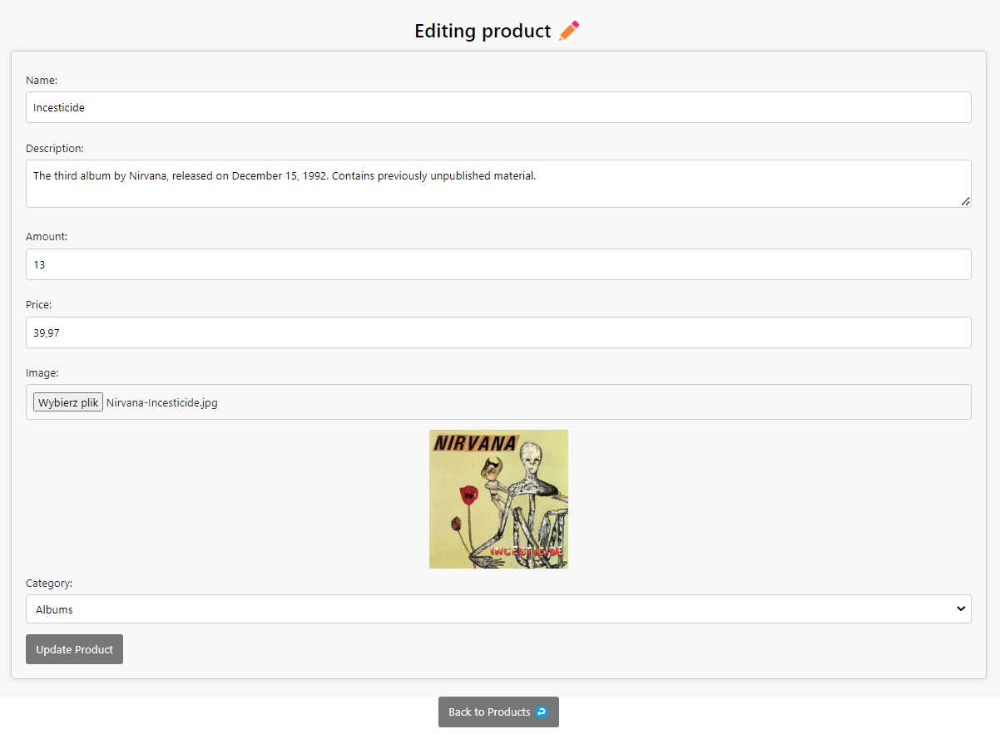

  <i>Rys. 10. Widok formularza edycji produktu</i>

---

### 6. Sklep i koszyk 

Ostatnią z widocznych przez użytkownika zakładek jest podstrona <i>Shop</i>. Użytkownik ma możliwość przeglądania sklepu dotyczącego Nirvany, filtrowanie po kategoriach i cenach (kategorie jako checkbox, a ceny jako zakres od minimum do maksimum), a także wyświetlenie szczegółów produktu i dodawanie do koszyka, którego zawartość dla każdego użytkownika jest przechowywana w odpowiedniej kolekcji w bazie danych.

Strona umożliwia sprawdzenie ilości aktualnie wyświetlanych przedmiotów. Produkty są pobierane z bazy danych i jest możliwość ich modyfikacji właśnie przez wcześniej omówioną zakładkę <i>Products</i>. Po przejściu do koszyka można zobaczyć wszystkie wybrane produkty, ilość każdego z nich, cenę za sztukę i cenę za wybraną ilość sztuk. Można również usunąć przedmiot z koszyka. Pod listą produktów jest wyświetlana całkowita cena wszystkich przedmiotów. Przycisk odpowiedzialny za powrót do sklepu znajduje się w lewym górnym rogu podstrony.

  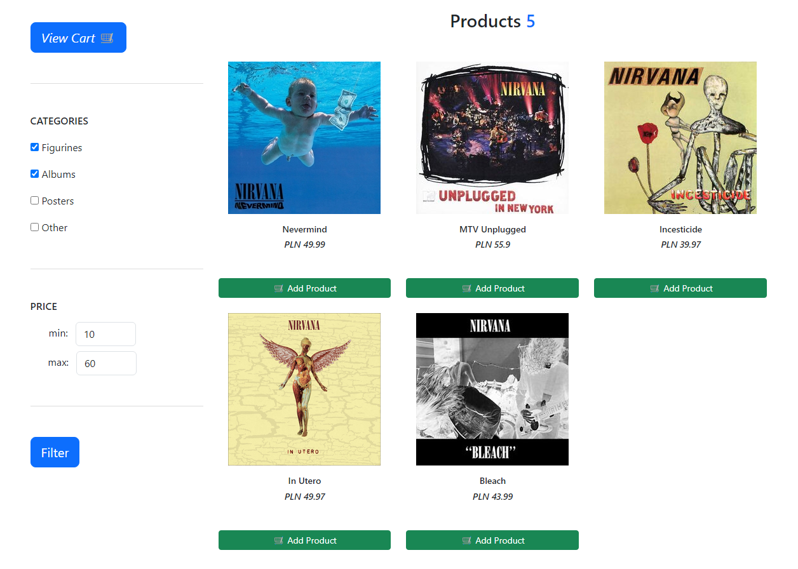

  <i>Rys. 11. Widok sklepu (filtrowanie po kategorii i cenach)</i>

 

  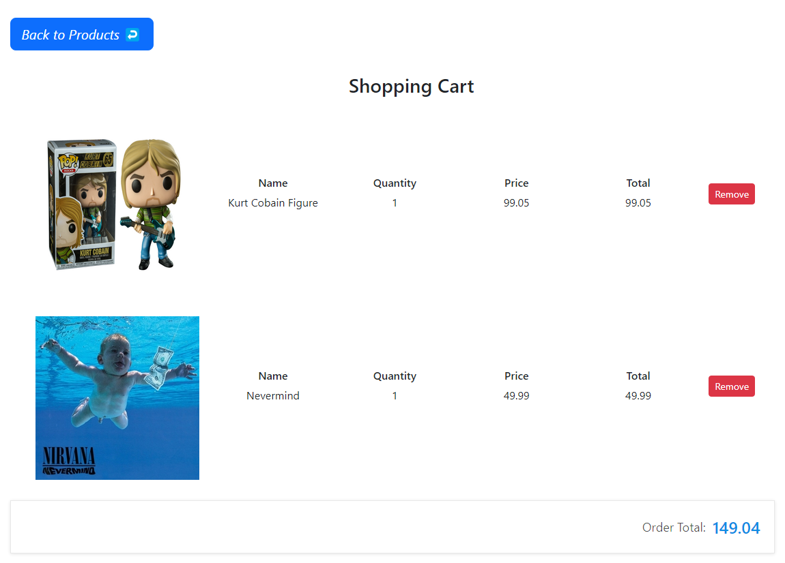

  <i>Rys. 12. Widok koszyka z dodanymi wcześniej produktami</i>

---

### 7. Podsumowanie

Realizowany projekt dotyczył stworzenia strony internetowej będącej fanpage’m zespołu Nirvana. Aplikacja została zaimplementowana za pomocą dwóch szkieletów programistycznych: po stronie serwera (express) i po stronie klienta (react). Aplikacja umożliwia przeglądanie listy fanów, wyświetlenie ich opinii i komentarzy, a także dodawanie, modyfikowanie i usuwanie własnych. Strona daje możliwość dodawania, edytowania, podglądu i usuwania produktów ze sklepu, a także przeglądania produktów w sklepie, filtrowanie po cenie i kategorii oraz dodawania przedmiotów do koszyka.

Aplikacja współpracuje z nierelacyjną bazą danych MongoDB, która oferuje funkcjonalności typowej aplikacji CRUD, co jest realizowane dla komentarzy i produktów. Hasła są odpowiednio haszowane, a funkcje aplikacji są dostępne tylko dla zalogowanych użytkowników i zabezpieczone tokenem przed nieuprawnionym dostępem. Serwer udostępnia interfejs API w architekturze REST. Wszystkie formularze są walidowane zarówno po stronie klienta, jak i serwera, z wykorzystaniem odpowiednich bibliotek, filtrów i wyrażeń regularnych. Kod jest zorganizowany z wykorzystaniem modeli, tras routingu i funkcji middleware po stronie serwera, czy komponentów po stronie klienta.

